<h1 id="title" style="text-align: center">1º Hackathon Questrade - Front end</h1>

## Índice
- [Descrição do projeto](#descrição-do-projeto)
- [Funcionamento da aplicação](#funcionamento-da-aplicação)
  - [Login/cadastro](#logincadastro)
  - [Rastreio de pagamentos](#rastreio-de-pagamentos)
  - [Solicitação de empréstimo](#solicitação-de-empréstimo)
  - [Atualização cadastral](#atualização-cadastral)
  - [Suporte ao cliente](#suporte-ao-cliente)
- [Próximos passos](#próximos-passos)
- [Dificuldades](#dificuldades)

# Descrição do projeto
Para o front-end da nossa aplicação decidimos utilizar Next.js com Tailwind css seguindo aproximadamente a identidade visual da Questrade. Os testes foram desenvolvidos utilizando Jest e RTL.

O design da nossa aplicação foi majoritariamente feito pela [Naiane Reis](https://github.com/NaianeReis27), porém, devido a problemas pessoais, ela decidiu se ausentar do Hackathon, mas nos permitiu utilizar o que ela já havia construído.

A conclusão do design e a aplicação do que foi montado no Figma foi desenvolvido por [Débora Serra](https://github.com/DeboraSerra) e [Diego Cavalcanti](https://github.com/diegotimao).

Os cenários de testes foram desenvolvidos por [Márcio Lembi](https://github.com/Marcio-Lembi-Teles) e os testes foram implementados por [Diego Cavalcanti](https://github.com/diegotimao) e [Débora Serra](https://github.com/DeboraSerra) 

# Funcionamento da aplicação

## Login/cadastro
Ao acessar a página principal, a pessoa usuária tem a opção de fazer login ou fazer o cadastro, conforme imagens abaixo.

  
Versão desktop

  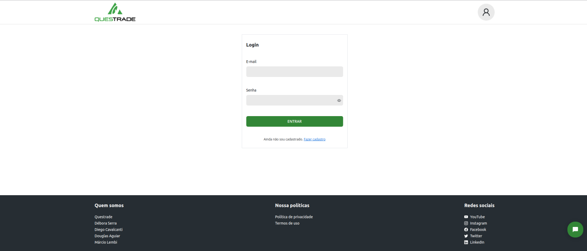
  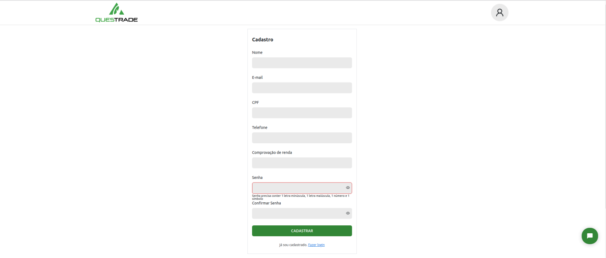

  
Versão mobile

  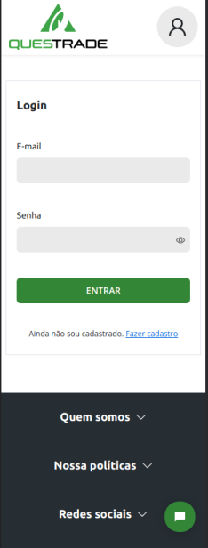
  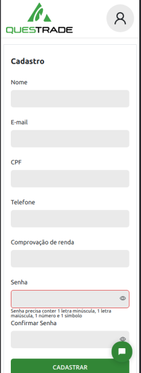

## Rastreio de pagamentos
Após a pessoa usuária fazer o cadastro ou login, ela é redirecionada para a rota /dashboard onde pode visualizar os registros de pagamento efetuados e pendentes, caso ela possua algum empréstimo, assim como o score dela. A pessoa usuária pode também utilizar o botão para registrar o pagamento da parcela, sendo que o mesmo encontra-se desabilitado em parcelas já quitadas.

Para facilitar a visualização da pessoa usuária, as parcelas já pagas são ressaltadas em verde, as que estão próximas do vencimento em amarelo e as que venceram e não foram pagas estão em vermelho.

  
Versão desktop

  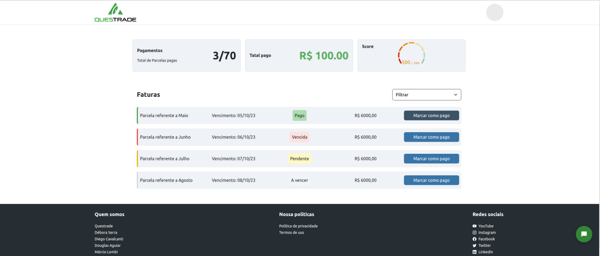

  
Versão mobile

  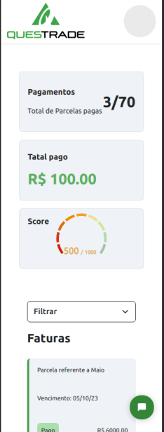

Caso a pessoa usuária seja nova no sistema ou caso ela não possua nenhum empréstimo vigente, a tela de dashboard aparece como na imagem abaixo e com o botão para solicitar um novo empréstimo.

  
Versão desktop

  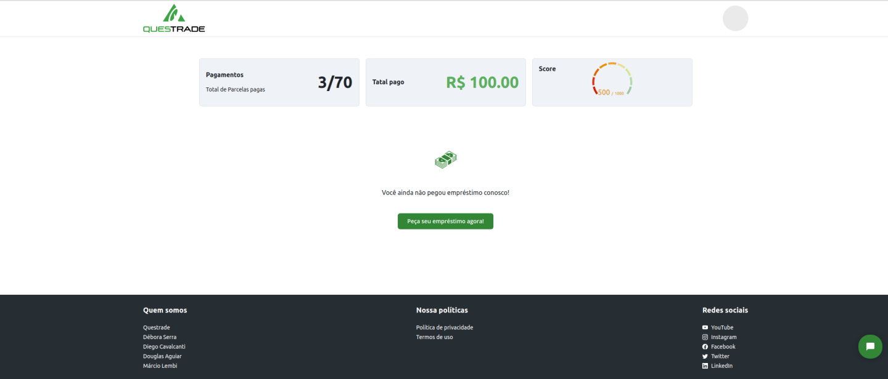

  
Versão mobile

  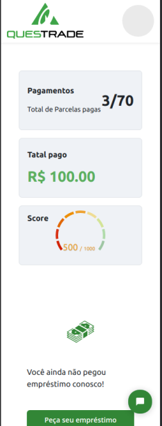

## Solicitação de empréstimo

Após clicar no botão para solicitar um empréstimo, a pessoa usuária é redirecionada para a rota /new-loan, onde é solicitado que ela preencha o valor do empréstimo e o número de parcelas em que ele será pago. Com base nesses valores a aplicação gera o valor aproximado da parcela.

  
Versão desktop

  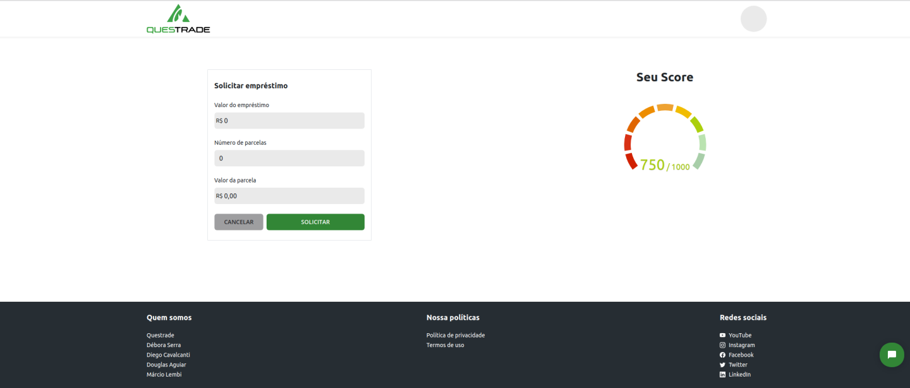

  
Versão mobile

  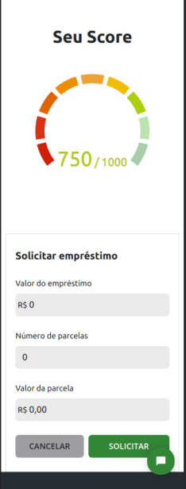

## Atualização cadastral

A pessoa usuária pode também atualizar seus dados cadastrais, clicando na foto no topo direito da aplicação e em seguida no link perfil. Ela é então redirecionada para a rota /profile, onde ela pode editar seu nome, telefone ou e-mail.

  
Versão desktop

  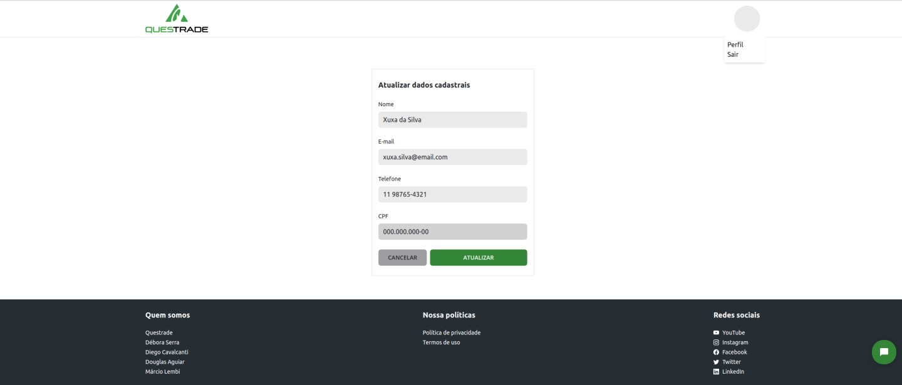

  
Versão mobile

  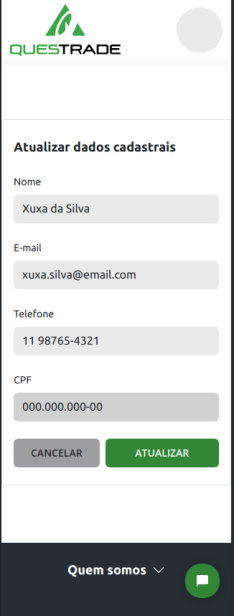

## Suporte ao cliente

Para o suporte ao cliente foi adicionado o ChatBot da [Tidio](https://www.tidio.com) com três possíveis rotas de auxilio.

  
Versão desktop

  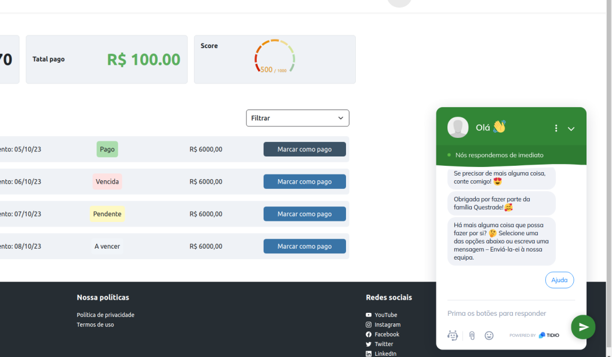

  
Versão mobile

  

# Próximos passos

Os próximos passos da aplicação são:
* Desenvolver e implementar o serviço de solicitação e controle de empréstimos, sendo que foi iniciado utilizando express.js e MongoDB, porém não foi possível finalizar.
* Adicionar a foto de perfil da pessoa usuária
* Receber documento de comprovação de renda e fazer a confirmação da informação recebida
* Adicionar opção de editar a informação de renda
* Incrementar as opções de suporte ao cliente.

# Dificuldades

A biblioteca react-score-indicator não é mantida desde 2020 e não foi possível instalar, sendo assim, pegamos o código e passamos para typescript com atualizações pertinentes, para podermos utilizá-la e pretendemos abrir um pull request no repositório original para sugerir uma atualização para o código fonte.
